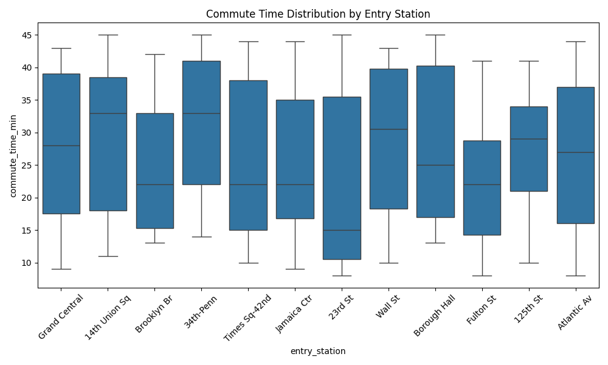

# 🚉 NYC Commute Data Analysis (Python Portfolio Project)

This project demonstrates a complete data workflow using Python — from synthetic data generation to analysis and visualization. It simulates real-world subway commute behavior in New York City and provides insights into patterns like commute time, station usage, delays, and payment methods.

---

## 📁 Project Structure

```
📦 Portfolio/
├── commute_data.csv                 # Synthetic dataset
├── generate_commute_data.py        # Script to generate realistic commute data
├── analyze_commute_data.py         # Generates summary + saves visualizations
├── explore_commute_data.py         # Interactive analysis with matplotlib
├── visualizations/                 # Output plots
│   ├── commute_time_by_station.png
│   ├── payment_method_distribution.png
│   └── delay_vs_transfers.png
└── README.md                       # This file
```

---

## 🧠 Features & Skills Used

- **Data Cleaning**: Removing missing values, formatting columns
- **Exploratory Data Analysis (EDA)**: Using `pandas`, `matplotlib`, and `seaborn`
- **Data Generation**: Creating realistic synthetic datasets for practice
- **Visualization**: Clear, professional plots for insights
- **Python Libraries**: 
  - `pandas`
  - `matplotlib`
  - `seaborn`
  - `os`, `datetime`, `random`

---

## 📊 Insights Uncovered

- **Average commute time**
- **Most common entry stations**
- **Train delay patterns**
- **Payment method preference (OMNY vs MetroCard)**
- **Effect of transfer count on delay time**

---

## 🔧 How to Run

1. Install dependencies:

```bash
pip install pandas matplotlib seaborn
```

2. Run the data generator:

```bash
python generate_commute_data.py
```

3. Run the analysis:

```bash
python analyze_commute_data.py
```

4. (Optional) Run the interactive explorer:

```bash
python explore_commute_data.py
```

---

## 📁 Sample Visualization



---

## ✅ Use Cases

This project can be used to:
- Showcase Python data skills for freelance or full-time roles
- Demonstrate EDA skills in Upwork / Fiverr gigs
- Practice data storytelling and reporting

---

## 📧 Contact

**Renz Navarro**  
📬 Email: renzivannavarro215@gmail.com 

# invoice-generator
